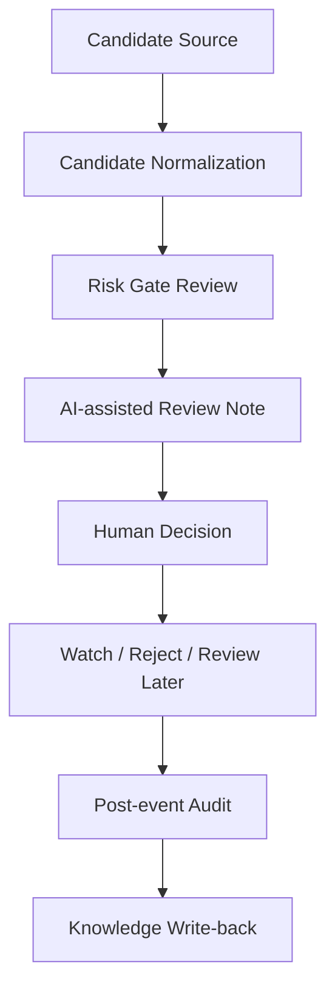
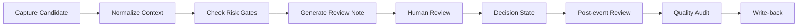

# AI Quant Review System

## Portfolio Note

This repository is a public-safe portfolio case prepared by QIAN Boyu (Bowie)
for graduate applications in AI, enterprise AI systems, and the SUTD MSc in
Design and Artificial Intelligence for Enterprise.

This repository does not provide trading signals, financial advice, proprietary
strategy rules, account data, or automated trading code.

## Project Summary

AI Quant Review System is an AI-assisted crypto trading candidate review and
human-in-the-loop risk review workflow.

The project focuses on candidate review, risk gate design, structured decision
notes, quality audit, post-event learning, and human judgment under uncertainty.
It is designed as a review and governance framework, not as an automated trading
bot or profitable strategy.

## Problem Context

High-uncertainty markets create many possible trading ideas. Raw candidate
opportunities may be noisy, late, incomplete, or risky.

A useful system should not only surface candidates; it should support structured
review, risk filtering, decision logging, and later quality audit. Human
judgment remains necessary because market context, timing, risk tolerance, and
false positives are difficult to automate safely.

## My Role

Founder / Product Designer / AI Workflow Designer

Responsibilities:

- Problem framing
- Review workflow design
- Risk gate concept
- Quality audit loop
- Candidate review structure
- Public-safe documentation

## Current Implementation Status

Completed:

- Problem framing
- Public-safe review workflow design
- Candidate review structure
- Risk gate concept
- Human-in-the-loop decision logic
- Quality audit concept
- Portfolio-safe documentation

In Progress:

- Synthetic review examples
- Public-safe dashboard mockups
- Post-event review templates
- Quality audit scoring framework
- Safer separation between candidate generation and human review

Not Included Publicly:

- Real trading signals
- Strategy parameters
- Backtest data
- Exchange account data
- PnL
- Order history
- Portfolio holdings
- Private watchlists
- Private prompts
- API keys/tokens
- Telegram configuration
- Production deployment details

## Repository Structure

```text
ai-quant-review-system/
├── README.md
├── docs/
│   ├── project-overview.md
│   ├── system-architecture.md
│   ├── workflow.md
│   ├── candidate-review-framework.md
│   ├── risk-gate-design.md
│   ├── quality-audit-loop.md
│   ├── data-governance.md
│   ├── evaluation-rubric.md
│   ├── sample-review-note.md
│   ├── product-roadmap.md
│   └── sutd-fit.md
└── assets/
    └── README.md
```

- `docs/project-overview.md`: problem, users, AI value, human review, role, and
  portfolio boundary.
- `docs/system-architecture.md`: high-level architecture and review layers.
- `docs/workflow.md`: operating workflow from candidate capture to write-back.
- `docs/candidate-review-framework.md`: review structure for candidate
  opportunities.
- `docs/risk-gate-design.md`: conceptual public-safe risk gate examples.
- `docs/quality-audit-loop.md`: post-event learning and audit process.
- `docs/data-governance.md`: public/private boundaries and excluded sensitive
  data.
- `docs/evaluation-rubric.md`: criteria for evaluating review quality.
- `docs/sample-review-note.md`: fictional synthetic review note.
- `docs/product-roadmap.md`: staged development path.
- `docs/sutd-fit.md`: connection to SUTD DAI-E.
- `assets/README.md`: rules for future public-safe visual assets.

## System Overview



## Review Workflow



## Responsible AI and Safety Boundaries

This is not financial advice. This is not an automated trading system.

No real signals or proprietary strategy rules are included. AI outputs are
review aids only, and human review is required.

Risk, uncertainty, and review state must be explicit. This public repository
excludes sensitive trading and account data, including account records, order
history, portfolio holdings, PnL, API keys, tokens, Telegram configuration,
private prompts, real alerts, private watchlists, backtest files, and production
deployment details.

## Relevance to SUTD MSc DAI-E

This project connects to the SUTD MSc in Design and Artificial Intelligence for
Enterprise through:

- Design-led workflow framing
- AI-assisted decision support
- Human-AI collaboration
- Risk-aware system design
- Governance and auditability
- Decision-making under uncertainty
- Enterprise-style review workflow

The project reflects my interest in AI systems that support structured human
judgment, preserve rationale, and improve review quality without replacing
responsibility.

## Next Steps

- Expand synthetic review examples
- Create public-safe dashboard mockups
- Add structured post-event review template
- Add quality audit scoring examples
- Prepare screenshots only after all four portfolio repositories are complete
