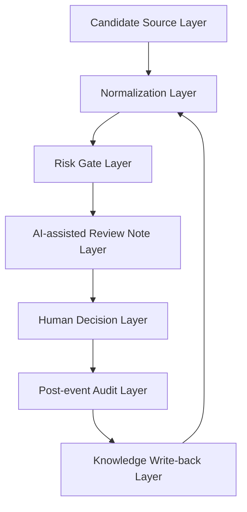

# System Architecture

## High-Level Architecture

AI Quant Review System is designed as a human-in-the-loop review architecture
for candidate opportunities. It structures candidate context, risk gates, review
notes, human decisions, post-event audit, and knowledge write-back.

## Candidate Source Layer

The candidate source layer represents possible candidate inputs. In this
public-safe repository, candidates are described only as synthetic examples.

The public repository does not include real alerts, private watchlists, real
candidate signals, exchange data, strategy code, or private system internals.

## Normalization Layer

The normalization layer converts a candidate into a consistent review format. It
may include a short summary, context, known uncertainty, missing information,
and initial review state.

## Risk Gate Layer

The risk gate layer checks whether the candidate has visible risk conditions
that should be reviewed before any decision.

Risk gates are conceptual examples only. They are not real trading rules,
filters, thresholds, or proprietary strategy parameters.

## AI-Assisted Review Note Layer

AI can help draft a structured review note from normalized context. The output
may include risk factors, missing information, review questions, and possible
follow-up states.

AI output is a review aid, not a decision.

## Human Decision Layer

The human reviewer decides whether the candidate should be watched, rejected, or
reviewed later.

This layer preserves human judgment and prevents the workflow from becoming
automated trading.

## Post-Event Audit Layer

The post-event audit layer reviews decision quality after the candidate has
become outdated, resolved, or no longer relevant.

The audit focuses on review quality, false positives, missing context, late
candidates, and lessons learned. It does not require PnL or real trade data.

## Knowledge Write-back Layer

The write-back layer records lessons learned and updates review checklists, risk
gate descriptions, or quality audit notes.

## Limitations

Current limitations:

- Public documentation only
- Synthetic examples only
- No real candidate signals
- No account data
- No automated execution
- No real strategy code
- No proprietary rules, filters, or thresholds
- No profitability claim
