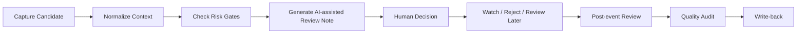

# Workflow

## 1. Capture Candidate

Capture a candidate opportunity as a review item. In this public repository, candidates are synthetic and do not represent real trading signals.

## 2. Normalize Context

Normalize the candidate into a consistent structure: summary, context, timing concern, missing information, and initial uncertainty.

## 3. Check Risk Gates

Review conceptual risk gates before considering any follow-up.

Example categories include information uncertainty, late-entry risk, volatility risk, source reliability concern, and emotional/overtrading risk. These are public-safe examples, not real trading rules.

## 4. Generate AI-Assisted Review Note

AI assists by drafting a structured review note with risk factors, missing information, and human review questions.

The AI output must remain a review aid.

## 5. Human Decision

The human reviewer checks context, uncertainty, risk gates, and review quality.

## 6. Watch / Reject / Review Later

The decision state can be:

- Watch
- Reject
- Review later
- Needs more information
- Closed

These states are review states, not automated trade actions.

## 7. Post-Event Review

After the candidate is no longer active or relevant, review whether the original note was clear, timely, and risk-aware.

## 8. Quality Audit

Audit the review process for false positives, missing context, late candidates, unclear uncertainty, and weak review questions.

## 9. Write-back

Write back lessons learned to improve the review checklist and future risk gate descriptions.

